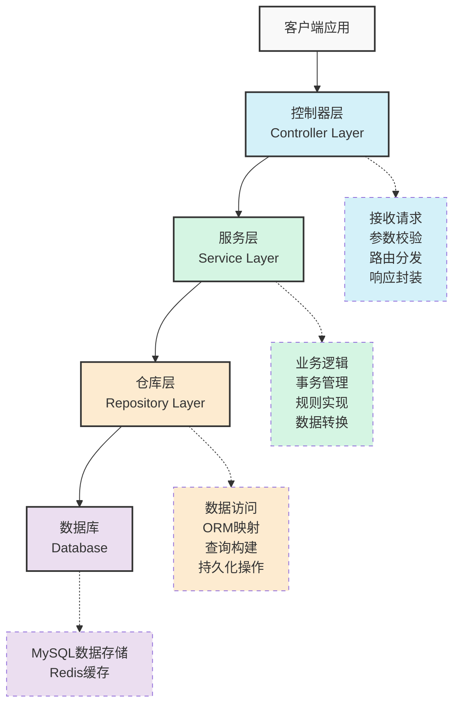
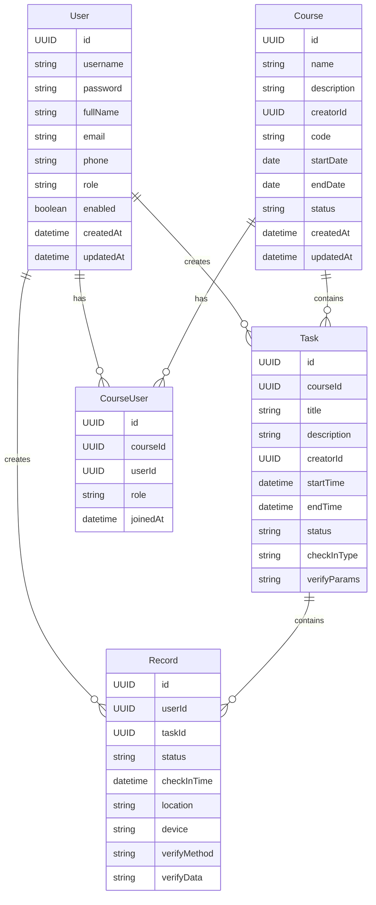
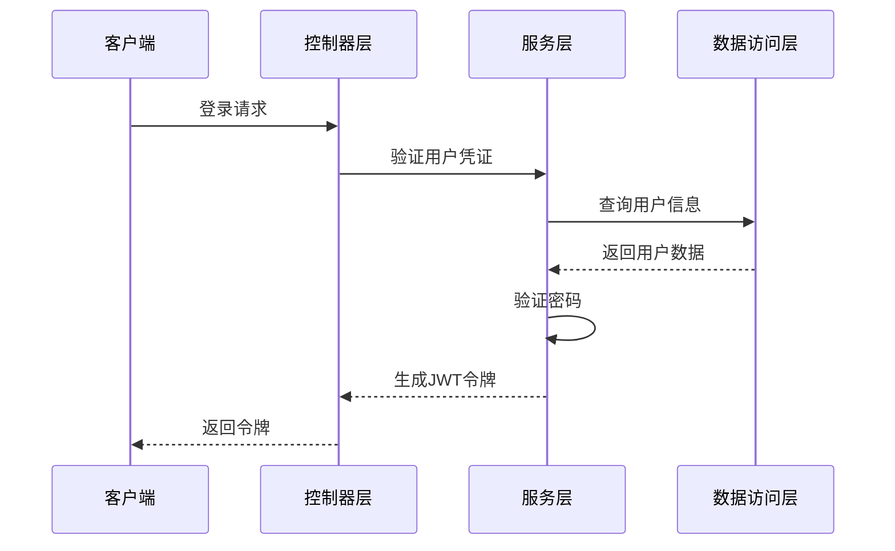
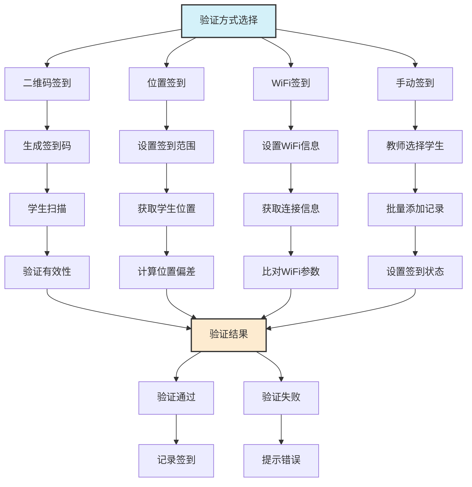
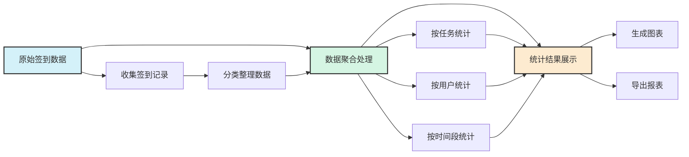

# 智能考勤系统 - 后端服务

本项目是智能考勤系统的后端服务，基于Spring Boot 3.x开发，提供完整的考勤管理功能API。

## 项目架构

项目采用了分层架构设计：



## 项目结构

```
com.attendance
├── controller/          # 所有控制器
│   ├── auth/            # 认证相关控制器
│   ├── user/            # 用户相关控制器
│   ├── task/            # 任务相关控制器
│   └── record/          # 签到记录相关控制器
├── service/             # 所有服务
│   ├── auth/            # 认证相关服务
│   ├── user/            # 用户相关服务
│   ├── task/            # 任务相关服务
│   └── record/          # 签到记录相关服务
├── repository/          # 所有数据访问
│   ├── user/            # 用户相关存储库
│   ├── task/            # 任务相关存储库
│   └── record/          # 签到记录相关存储库
├── model/               # 所有数据模型
│   ├── entity/          # 实体类
│   ├── dto/             # 数据传输对象
│   └── vo/              # 视图对象
├── common/              # 通用组件
│   ├── config/          # 配置类
│   │   ├── security/    # 安全配置
│   │   ├── redis/       # Redis配置
│   │   └── web/         # Web相关配置
│   ├── exception/       # 异常处理
│   ├── util/            # 工具类
│   └── constants/       # 常量定义
└── AttendanceApplication.java  # 应用入口
```

## 技术栈

- **核心框架**：Spring Boot 3.x
- **安全框架**：Spring Security + JWT
- **数据访问**：Spring Data JPA
- **数据存储**：MySQL + Redis
- **API规范**：RESTful API
- **参数校验**：Jakarta Bean Validation
- **日志框架**：SLF4J + Logback
- **工具库**：Lombok, MapStruct, Guava

## 开发环境搭建

### 前置要求

- JDK 17+
- Maven 3.8+
- MySQL 8.0+
- Redis 6.0+

### 启动步骤

1. 克隆项目
   ```
   git clone https://github.com/yourusername/attendance-backend.git
   ```

2. 配置数据库
   - 修改 `src/main/resources/application.yml` 中的数据库连接参数

3. 编译项目
   ```
   mvn clean package
   ```

4. 运行项目
   ```
   java -jar target/attendance-service-0.0.1-SNAPSHOT.jar
   ```

## API文档

启动项目后，访问 Swagger 文档：

```
http://localhost:8080/swagger-ui.html
```

## 开发规范

1. **命名规范**：
   - 类名：大驼峰（如 UserController）
   - 方法名：小驼峰（如 getUserById）
   - 变量名：小驼峰（如 userName）
   - 常量名：全大写下划线分隔（如 MAX_COUNT）

2. **注释规范**：
   - 类注释：描述类的功能和用途
   - 方法注释：描述方法的功能、参数和返回值
   - 重要代码注释：解释复杂逻辑

3. **代码提交规范**：
   - 提交前执行测试确保通过
   - 提交信息格式：`[模块名] 操作描述`（如：`[Auth] 修复登录验证bug`）

## 参考文档

详细设计文档请参考 `docs/设计文档.md`。

## 一、后端架构设计

### 1.1 架构概述

智能考勤系统后端采用分层架构设计，基于Spring Boot框架实现，各层职责清晰，便于维护与扩展：


#### 分层职责

- **控制器层(Controller)**
  - 处理HTTP请求和响应
  - 进行参数验证和转换
  - 调用适当的服务层方法
  - 封装响应数据和状态

- **服务层(Service)**
  - 实现核心业务逻辑
  - 协调多个资源操作
  - 管理事务边界
  - 应用领域规则和约束

- **仓库层(Repository)**
  - 提供数据访问接口
  - 实现ORM实体映射
  - 构建复杂查询
  - 执行持久化操作

- **数据层(Database)**
  - MySQL存储核心业务数据
  - Redis提供缓存和会话支持
  - 提供数据持久化保障
  - 支持事务和数据一致性

#### 横切关注点

- **安全机制**: 基于Spring Security的认证授权
- **缓存策略**: 利用Redis实现多级缓存
- **异常处理**: 全局统一的异常处理机制
- **日志记录**: 分级记录系统运行状态
- **参数验证**: 统一的请求参数验证

这种分层架构能够实现关注点分离，提高代码可维护性和可测试性，同时便于团队协作和功能扩展。

### 1.2 技术栈选型

- **核心框架**：Spring Boot 3.x
- **安全框架**：Spring Security + JWT
- **数据访问**：Spring Data JPA
- **数据存储**：MySQL + Redis
- **API规范**：RESTful API
- **参数校验**：Jakarta Bean Validation
- **日志框架**：SLF4J + Logback
- **工具库**：Lombok (简化代码), MapStruct (对象映射), Guava (通用工具)

### 1.3 包结构设计

```
com.attendance
├── controller/          # 所有控制器
│   ├── auth/            # 认证相关控制器
│   ├── user/            # 用户相关控制器
│   ├── task/            # 任务相关控制器
│   └── record/          # 签到记录相关控制器
├── service/             # 所有服务
│   ├── auth/            # 认证相关服务
│   ├── user/            # 用户相关服务
│   ├── task/            # 任务相关服务
│   └── record/          # 签到记录相关服务
├── repository/          # 所有数据访问
│   ├── user/            # 用户相关存储库
│   ├── task/            # 任务相关存储库
│   └── record/          # 签到记录相关存储库
├── model/               # 所有数据模型
│   ├── entity/          # 实体类
│   ├── dto/             # 数据传输对象
│   └── vo/              # 视图对象
├── common/              # 通用组件
│   ├── config/          # 配置类
│   │   ├── security/    # 安全配置
│   │   ├── redis/       # Redis配置
│   │   └── web/         # Web相关配置
│   ├── exception/       # 异常处理
│   ├── util/            # 工具类
│   └── constants/       # 常量定义
└── AttendanceApplication.java  # 应用入口
```

### 1.4 核心组件设计

#### 1.4.1 全局响应处理

统一的响应结构设计，确保API返回格式一致：

- **标准响应字段**：状态码、消息、数据
- **成功响应**：包含状态码200及业务数据
- **错误响应**：包含错误码及错误详情
- **分页响应**：包含分页信息及列表数据

#### 1.4.2 全局异常处理

统一的异常处理机制，将各类异常转换为规范的API响应：

- **业务异常**：处理业务规则验证失败
- **资源未找到异常**：处理请求的资源不存在
- **参数验证异常**：处理请求参数格式错误
- **认证授权异常**：处理权限不足或未认证
- **系统异常**：处理未预期的系统错误

#### 1.4.3 安全配置

基于Spring Security的认证授权机制：

- **无状态设计**：基于JWT的无状态认证
- **权限控制**：基于角色的访问控制（RBAC）
- **请求过滤**：JWT认证过滤器校验令牌
- **资源保护**：API资源按角色划分权限
- **密码加密**：BCrypt加密保护用户密码

#### 1.4.4 Redis缓存配置

使用Redis进行缓存和会话管理：

- **数据缓存**：减少数据库压力，提高响应速度
- **会话存储**：存储用户会话和认证信息
- **分布式锁**：处理并发问题和竞态条件
- **缓存策略**：设置合理的过期时间和淘汰策略
- **序列化配置**：JSON序列化实现对象存储

## 二、数据模型设计

### 2.1 实体关系图



### 2.2 课程与群组设计

系统采用课程作为群组单位，实现了图结构的设计模式：

#### 课程群组模型

- **Course（课程）**：代表一个教学单位，由老师创建
- **User（用户）**：可以是教师或学生
- **Course_User（课程-用户关系）**：表示用户与课程的多对多关系
- **Task（签到任务）**：归属于特定课程，只对课程内的学生可见

#### 群组关系流程

1. **课程创建**：
   - 教师创建课程，设置课程名称、描述等信息
   - 系统自动生成唯一的课程邀请码
   - 创建者自动成为课程管理员

2. **学生加入**：
   - 学生通过课程邀请码申请加入
   - 老师通过学号/邮箱批量导入学生
   - 老师直接向学生发送邀请链接

3. **签到任务发布**：
   - 老师在课程内创建签到任务
   - 任务自动关联到该课程
   - 只有课程内的学生能看到并参与签到

4. **权限控制**：
   - 课程创建者（老师）拥有管理权限
   - 普通成员（学生）拥有参与权限
   - 系统管理员拥有全局权限

#### 技术实现

课程群组采用了图数据结构：
- 节点：用户(User)和课程(Course)
- 边：用户与课程的关系(Course_User)
- 属性：关系类型(role)、加入时间等

这种设计允许：
- 一个学生可以加入多个课程
- 一个老师可以管理多个课程
- 一个课程可以关联多个签到任务
- 隔离不同课程的签到任务和学生

通过这种图结构，系统能够有效管理复杂的教学组织结构，确保签到任务仅对相关学生可见，提高系统的安全性和针对性。

### 2.3 实体设计

#### 2.3.1 用户实体 (User)

**核心属性**：
- 用户ID（主键）
- 用户名（唯一标识）
- 密码（加密存储）
- 姓名
- 邮箱
- 角色（学生、教师、系统管理员）
- 账户状态
- 创建时间
- 更新时间

**业务规则**：
- 用户名全局唯一
- 密码必须加密存储
- 用户角色决定权限范围
- 创建和更新时间自动设置

#### 2.3.2 签到任务实体 (Task)

**核心属性**：
- 任务ID（主键）
- 任务标题
- 任务描述
- 创建者ID（关联用户）
- 开始时间
- 结束时间
- 任务状态（创建、进行中、已结束）
- 签到类型（二维码、位置、WiFi、手动）
- 验证参数（根据签到类型存储相关信息）

**业务规则**：
- 只有教师和管理员可以创建任务
- 任务状态随时间自动变化
- 任务结束后不可再签到
- 验证参数格式由签到类型决定

#### 2.3.3 签到记录实体 (Record)

**核心属性**：
- 记录ID（主键）
- 用户ID（关联用户）
- 任务ID（关联任务）
- 签到状态（正常、迟到、缺席）
- 签到时间
- 签到位置
- 设备信息
- 验证方式
- 验证数据

**业务规则**：
- 每个用户对每个任务只能有一条签到记录
- 签到状态根据任务时间自动判定
- 验证数据需与任务设置的验证要求匹配
- 记录签到设备信息用于异常分析

### 2.4 DTO设计

#### 2.4.1 请求DTO

- **用户认证请求**：用户名和密码
- **任务创建请求**：任务标题、描述、时间、签到类型等
- **签到请求**：任务ID、验证数据、位置信息等

#### 2.4.2 响应DTO

- **用户信息响应**：不含敏感数据的用户信息
- **任务详情响应**：包含创建者信息的任务详情
- **签到记录响应**：包含用户和任务信息的签到记录
- **统计数据响应**：签到率、出勤状况等统计信息

### 2.5 VO设计

- **用户视图对象**：前端展示的用户信息
- **任务视图对象**：前端展示的任务信息
- **记录视图对象**：前端展示的签到记录信息
- **统计视图对象**：前端展示的统计结果信息

## 三、业务逻辑设计

### 3.1 用户认证与授权流程



认证流程设计：

1. **登录请求处理**：
   - 接收用户名和密码
   - 验证用户凭证有效性
   - 生成JWT令牌
   - 返回令牌及用户基本信息

2. **令牌验证流程**：
   - 提取请求头中的令牌
   - 验证令牌签名和有效期
   - 解析用户身份和权限
   - 构建安全上下文

3. **权限控制策略**：
   - 学生：只能访问自己的签到记录
   - 教师：可以管理任务和查看相关签到记录
   - 管理员：拥有系统所有权限

### 3.2 签到任务管理流程

```mermaid
flowchart LR
    A[开始] --> B[创建阶段]
    B --> C[教师创建任务]
    C --> D[设置验证方式]
    D --> E[指定起止时间]
    E --> F[活跃阶段]
    F --> G[学生签到]
    G --> H[验证签到数据]
    H --> I[记录签到状态]
    I --> J[完成阶段]
    J --> K[统计签到情况]
    K --> L[生成报表数据]
    L --> M[归档任务]
    M --> N[结束]
    
    style A fill:#f5f5f5,stroke:#333,stroke-width:1px
    style B fill:#d4f1f9,stroke:#333,stroke-width:1px
    style F fill:#d5f5e3,stroke:#333,stroke-width:1px
    style J fill:#fdebd0,stroke:#333,stroke-width:1px
    style N fill:#f5f5f5,stroke:#333,stroke-width:1px
```



任务管理流程设计：

1. **任务创建流程**：
   - 教师创建签到任务
   - 设置任务基本信息
   - 选择签到类型和验证规则
   - 设置起止时间
   - 保存并发布任务

2. **任务状态管理**：
   - 创建状态：任务已创建但未开始
   - 活跃状态：任务进行中，可以签到
   - 完成状态：任务已结束，不可签到
   - 状态自动流转：根据任务时间自动更新

3. **任务查询和筛选**：
   - 按创建者筛选
   - 按状态筛选
   - 按时间范围筛选
   - 按关键词搜索

### 3.3 签到验证流程



签到验证流程设计：

1. **二维码签到流程**：
   - 系统生成包含签到信息的二维码
   - 学生扫描二维码获取签到数据
   - 验证二维码有效性和时效性
   - 记录签到状态和时间

2. **位置签到流程**：
   - 教师设置有效签到范围
   - 学生提交当前位置信息
   - 系统计算位置偏差是否在允许范围内
   - 通过位置验证后记录签到

3. **WiFi签到流程**：
   - 教师设置指定WiFi信息
   - 学生提交当前连接的WiFi信息
   - 验证学生WiFi信息与指定信息是否匹配
   - 匹配成功后记录签到

4. **手动签到流程**：
   - 教师查看学生列表
   - 选择需要标记的学生
   - 设置签到状态（正常、迟到、缺席）
   - 提交批量签到记录

### 3.4 数据统计分析流程



数据统计分析流程设计：

1. **数据收集**：
   - 获取指定范围内的签到记录
   - 按不同维度分类整理数据
   - 准备用于统计分析的数据集

2. **统计计算**：
   - 任务维度：出勤率、迟到率、缺席率
   - 用户维度：个人出勤情况、异常记录
   - 时间维度：不同时间段的签到趋势
   - 多维分析：交叉对比不同维度数据

3. **结果展示**：
   - 数据可视化：图表、仪表盘
   - 数据导出：Excel、PDF报表
   - 异常提醒：识别并标记异常签到模式

## 四、接口设计

### 4.1 基础规范

#### 基础URL
所有API均以 `/api` 为前缀。

#### 请求方法
- **GET**: 获取资源
- **POST**: 创建资源、执行操作或更新资源

#### 响应格式
所有API响应均使用JSON格式，包含以下字段：
```json
{
  "code": 200,           // 状态码：200成功，非200表示错误
  "message": "操作成功",   // 操作结果描述
  "data": {}             // 响应数据，可能是对象或数组
}
```

#### 分页格式
分页查询返回格式：
```json
{
  "code": 200,
  "message": "查询成功",
  "data": {
    "content": [],        // 当前页数据
    "totalElements": 100, // 总记录数
    "totalPages": 10,     // 总页数
    "size": 10,           // 每页大小
    "number": 0,          // 当前页码(从0开始)
    "first": true,        // 是否为第一页
    "last": false,        // 是否为最后一页
    "empty": false        // 是否为空结果
  }
}
```

#### 分页参数
所有列表查询支持以下分页参数：
- `page`: 页码(从0开始)，默认0
- `size`: 每页大小，默认10，最大100

#### 错误码
- 200: 成功
- 400: 请求参数错误
- 401: 未认证
- 403: 权限不足
- 404: 资源不存在
- 409: 资源冲突
- 500: 服务器内部错误

### 4.2 API概览列表

#### 认证与用户API

| 接口 | 方法 | URL | 描述 |
|------|------|-----|------|
| 用户登录 | POST | /api/auth/login | 登录系统获取JWT令牌 |
| 用户注册 | POST | /api/auth/register | 注册新用户 |
| 获取当前用户信息 | GET | /api/users/current | 获取当前登录用户信息 |
| 获取用户列表 | GET | /api/users/list | 获取用户列表(分页) |
| 获取用户详情 | GET | /api/users/detail | 获取指定用户详情 |
| 更新用户信息 | POST | /api/users/update | 更新用户信息 |

#### 课程API

| 接口 | 方法 | URL | 描述 |
|------|------|-----|------|
| 创建课程 | POST | /api/courses/create | 创建新课程 |
| 获取课程列表 | GET | /api/courses/list | 获取所有课程(分页) |
| 获取我的课程 | GET | /api/courses/my-list | 获取当前用户的课程(分页) |
| 获取课程详情 | GET | /api/courses/detail | 获取课程详细信息 |
| 更新课程 | POST | /api/courses/update | 更新课程信息 |
| 删除课程 | POST | /api/courses/remove | 删除课程 |

#### 课程成员API

| 接口 | 方法 | URL | 描述 |
|------|------|-----|------|
| 获取课程成员列表 | GET | /api/courses/members/list | 获取课程成员(分页) |
| 添加课程成员 | POST | /api/courses/members/add | 批量添加课程成员 |
| 移除课程成员 | POST | /api/courses/members/remove | 移除课程成员 |
| 加入课程 | POST | /api/courses/members/join | 通过邀请码加入课程 |

#### 签到任务API

| 接口 | 方法 | URL | 描述 |
|------|------|-----|------|
| 创建签到任务 | POST | /api/courses/tasks/create | 创建课程签到任务 |
| 获取签到任务列表 | GET | /api/courses/tasks/list | 获取课程签到任务(分页) |
| 更新签到任务 | POST | /api/courses/tasks/update | 更新签到任务 |
| 删除签到任务 | POST | /api/courses/tasks/remove | 删除签到任务 |

#### 签到记录API

| 接口 | 方法 | URL | 描述 |
|------|------|-----|------|
| 提交签到 | POST | /api/attendance/records/create | 学生提交签到 |
| 获取签到记录列表 | GET | /api/attendance/records/list | 获取签到记录(分页) |
| 手动签到 | POST | /api/attendance/records/manual-create | 教师为学生手动添加签到 |
| 更新签到记录 | POST | /api/attendance/records/update | 更新签到状态 |

#### 统计API

| 接口 | 方法 | URL | 描述 |
|------|------|-----|------|
| 获取课程签到统计 | GET | /api/statistics/course | 获取课程签到统计数据 |
| 获取学生签到统计 | GET | /api/statistics/student | 获取学生签到统计数据 |

### 4.3 详细API设计

#### 认证API

##### 用户登录
- **URL**: `/api/auth/login`
- **方法**: POST
- **描述**: 登录系统并获取认证令牌
- **请求体**:
  ```json
  {
    "username": "用户名",
    "password": "密码"
  }
  ```
- **响应**:
  ```json
  {
    "code": 200,
    "message": "登录成功",
    "data": {
      "accessToken": "JWT令牌",
      "tokenType": "Bearer",
      "userId": "用户ID",
      "username": "用户名",
      "fullName": "用户全名",
      "role": "用户角色"
    }
  }
  ```

##### 用户注册
- **URL**: `/api/auth/register`
- **方法**: POST
- **描述**: 注册新用户
- **请求体**:
  ```json
  {
    "username": "用户名",
    "password": "密码",
    "fullName": "用户全名",
    "email": "邮箱",
    "phone": "手机号",
    "role": "STUDENT或TEACHER"
  }
  ```
- **响应**:
  ```json
  {
    "code": 200,
    "message": "注册成功",
    "data": {
      "id": "用户ID",
      "username": "用户名",
      "fullName": "用户全名",
      "email": "邮箱",
      "role": "角色",
      "enabled": true,
      "createdAt": "创建时间",
      "updatedAt": "更新时间"
    }
  }
  ```

#### 用户API

##### 获取当前用户信息
- **URL**: `/api/users/current`
- **方法**: GET
- **描述**: 获取当前登录用户的信息
- **响应**:
  ```json
  {
    "code": 200,
    "message": "获取成功",
    "data": {
      "id": "用户ID",
      "username": "用户名",
      "fullName": "用户全名",
      "email": "邮箱",
      "phone": "手机号",
      "role": "角色",
      "enabled": true,
      "createdAt": "创建时间",
      "updatedAt": "更新时间"
    }
  }
  ```

##### 获取用户列表
- **URL**: `/api/users/list`
- **方法**: GET
- **描述**: 获取用户列表
- **权限**: 仅管理员和教师
- **查询参数**:
  - `role`(可选): 用户角色，如STUDENT、TEACHER
  - `keyword`(可选): 搜索关键词，匹配用户名、全名和邮箱
  - `page`: 页码
  - `size`: 每页大小
- **响应**: 分页格式

##### 获取用户详情
- **URL**: `/api/users/detail`
- **方法**: GET
- **描述**: 获取用户详情
- **查询参数**:
  - `id`: 用户ID
- **权限**: 仅允许管理员或用户本人访问
- **响应**:
  ```json
  {
    "code": 200,
    "message": "获取成功",
    "data": {
      "id": "用户ID",
      "username": "用户名",
      "fullName": "用户全名",
      "email": "邮箱",
      "phone": "手机号",
      "role": "角色",
      "enabled": true,
      "createdAt": "创建时间",
      "updatedAt": "更新时间"
    }
  }
  ```

##### 更新用户信息
- **URL**: `/api/users/update`
- **方法**: POST
- **描述**: 更新用户信息
- **权限**: 仅允许管理员或用户本人修改
- **请求体**:
  ```json
  {
    "id": "用户ID",
    "fullName": "更新的全名",
    "email": "更新的邮箱",
    "phone": "更新的手机号"
  }
  ```
- **响应**: 更新后的用户信息

#### 课程API

##### 创建课程
- **URL**: `/api/courses/create`
- **方法**: POST
- **描述**: 创建新课程
- **权限**: 教师和管理员
- **请求体**:
  ```json
  {
    "name": "课程名称",
    "description": "课程描述",
    "startDate": "开始日期",
    "endDate": "结束日期"
  }
  ```
- **响应**: 创建的课程信息

##### 获取课程列表
- **URL**: `/api/courses/list`
- **方法**: GET
- **描述**: 获取课程列表
- **查询参数**:
  - `status`(可选): 课程状态，如ACTIVE、ENDED
  - `keyword`(可选): 搜索关键词，匹配课程名称和描述
  - `page`: 页码
  - `size`: 每页大小
- **响应**: 分页格式的课程列表

##### 获取我的课程
- **URL**: `/api/courses/my-list`
- **方法**: GET
- **描述**: 获取当前用户参与的所有课程
- **查询参数**:
  - `status`(可选): 课程状态
  - `page`: 页码
  - `size`: 每页大小
- **响应**: 分页格式的课程列表

##### 获取课程详情
- **URL**: `/api/courses/detail`
- **方法**: GET
- **描述**: 获取课程详情
- **查询参数**:
  - `id`: 课程ID
- **权限**: 课程成员才可访问
- **响应**: 课程详情信息

##### 更新课程
- **URL**: `/api/courses/update`
- **方法**: POST
- **描述**: 更新课程信息
- **权限**: 仅课程创建者或管理员
- **请求体**:
  ```json
  {
    "id": "课程ID",
    "name": "更新的名称",
    "description": "更新的描述",
    "startDate": "更新的开始日期",
    "endDate": "更新的结束日期",
    "status": "更新的状态"
  }
  ```
- **响应**: 更新后的课程信息

##### 删除课程
- **URL**: `/api/courses/remove`
- **方法**: POST
- **描述**: 逻辑删除课程
- **权限**: 仅课程创建者或管理员
- **请求体**:
  ```json
  {
    "id": "课程ID",
    "deleteReason": "删除原因(可选)"
  }
  ```
- **响应**: 成功消息

#### 课程成员API

##### 获取课程成员列表
- **URL**: `/api/courses/members/list`
- **方法**: GET
- **描述**: 获取课程成员列表
- **权限**: 课程成员才可访问
- **查询参数**:
  - `courseId`: 课程ID
  - `role`(可选): 成员角色
  - `page`: 页码
  - `size`: 每页大小
- **响应**: 分页格式的成员列表

##### 添加课程成员
- **URL**: `/api/courses/members/add`
- **方法**: POST
- **描述**: 添加课程成员
- **权限**: 仅课程创建者或助教
- **请求体**:
  ```json
  {
    "courseId": "课程ID",
    "userIds": ["用户ID1", "用户ID2", ...],
    "role": "成员角色(如STUDENT)"
  }
  ```
- **响应**: 添加成功消息和添加的成员列表

##### 移除课程成员
- **URL**: `/api/courses/members/remove`
- **方法**: POST
- **描述**: 移除课程成员
- **权限**: 仅课程创建者或助教
- **请求体**:
  ```json
  {
    "courseId": "课程ID",
    "userId": "用户ID",
    "removeReason": "移除原因(可选)"
  }
  ```
- **响应**: 成功消息

##### 加入课程
- **URL**: `/api/courses/members/join`
- **方法**: POST
- **描述**: 通过邀请码加入课程
- **请求体**:
  ```json
  {
    "code": "课程邀请码",
    "joinMethod": "加入方式(CODE或QR_CODE)"
  }
  ```
- **响应**: 成功消息和课程信息

#### 签到任务API

##### 创建签到任务
- **URL**: `/api/courses/tasks/create`
- **方法**: POST
- **描述**: 创建课程签到任务
- **权限**: 仅课程创建者或助教
- **请求体**:
  ```json
  {
    "parentCourseId": "所属课程ID",
    "name": "签到任务名称",
    "description": "签到任务描述",
    "startTime": "签到开始时间",
    "endTime": "签到结束时间",
    "checkinType": "签到类型(QR_CODE/LOCATION/WIFI/MANUAL)",
    "verifyParams": {
      // 根据签到类型不同而不同
      // QR_CODE: {}
      // LOCATION: {"latitude": 纬度, "longitude": 经度, "radius": 半径}
      // WIFI: {"ssid": "WiFi名称", "bssid": "MAC地址"}
    }
  }
  ```
- **响应**: 创建的签到任务信息

##### 获取签到任务列表
- **URL**: `/api/courses/tasks/list`
- **方法**: GET
- **描述**: 获取课程的签到任务列表
- **权限**: 课程成员才可访问
- **查询参数**:
  - `courseId`: 课程ID
  - `status`(可选): 任务状态
  - `page`: 页码
  - `size`: 每页大小
- **响应**: 分页格式的签到任务列表

##### 更新签到任务
- **URL**: `/api/courses/tasks/update`
- **方法**: POST
- **描述**: 更新签到任务
- **权限**: 仅任务创建者或课程管理员
- **请求体**:
  ```json
  {
    "id": "签到任务ID",
    "name": "更新的名称",
    "description": "更新的描述",
    "startTime": "更新的开始时间",
    "endTime": "更新的结束时间",
    "status": "更新的状态"
  }
  ```
- **响应**: 更新后的签到任务信息

##### 删除签到任务
- **URL**: `/api/courses/tasks/remove`
- **方法**: POST
- **描述**: 逻辑删除签到任务
- **权限**: 仅任务创建者或课程管理员
- **请求体**:
  ```json
  {
    "id": "签到任务ID",
    "deleteReason": "删除原因(可选)"
  }
  ```
- **响应**: 成功消息

#### 签到记录API

##### 提交签到
- **URL**: `/api/attendance/records/create`
- **方法**: POST
- **描述**: 学生提交签到
- **请求体**:
  ```json
  {
    "courseId": "签到任务ID",
    "location": {
      "latitude": 纬度,
      "longitude": 经度
    },
    "device": "设备信息",
    "verifyMethod": "签到方式(QR_CODE/LOCATION/WIFI)",
    "verifyData": "签到验证数据"
  }
  ```
- **响应**: 签到结果

##### 获取签到记录列表
- **URL**: `/api/attendance/records/list`
- **方法**: GET
- **描述**: 获取签到记录
- **权限**: 教师可查看所有记录，学生只能查看自己的记录
- **查询参数**:
  - `courseId`(可选): 签到任务ID
  - `parentCourseId`(可选): 所属课程ID
  - `userId`(可选): 用户ID
  - `status`(可选): 签到状态
  - `startDate`(可选): 签到日期起始
  - `endDate`(可选): 签到日期结束
  - `page`: 页码
  - `size`: 每页大小
- **响应**: 分页格式的签到记录列表

##### 手动签到
- **URL**: `/api/attendance/records/manual-create`
- **方法**: POST
- **描述**: 教师为学生手动添加签到记录
- **权限**: 仅课程创建者或助教
- **请求体**:
  ```json
  {
    "courseId": "签到任务ID",
    "userId": "学生用户ID",
    "status": "签到状态(NORMAL/LATE/LEAVE)"
  }
  ```
- **响应**: 创建的签到记录

##### 更新签到记录
- **URL**: `/api/attendance/records/update`
- **方法**: POST
- **描述**: 更新签到记录（如修改状态）
- **权限**: 仅课程创建者或助教
- **请求体**:
  ```json
  {
    "id": "签到记录ID",
    "status": "更新的状态",
    "comment": "备注信息(可选)"
  }
  ```
- **响应**: 更新后的签到记录

#### 统计API

##### 获取课程签到统计
- **URL**: `/api/statistics/course`
- **方法**: GET
- **描述**: 获取课程签到统计信息
- **权限**: 仅课程创建者或助教
- **查询参数**:
  - `courseId`: 课程ID
- **响应**:
  ```json
  {
    "code": 200,
    "message": "获取成功",
    "data": {
      "courseId": "课程ID",
      "courseName": "课程名称",
      "totalStudents": 30,
      "totalTasks": 10,
      "attendanceRate": 0.95,
      "statusDistribution": {
        "NORMAL": 280,
        "LATE": 12,
        "ABSENT": 8
      },
      "taskStatistics": [
        {
          "taskId": "任务ID",
          "taskName": "任务名称",
          "date": "日期",
          "normalCount": 28,
          "lateCount": 1,
          "absentCount": 1,
          "attendanceRate": 0.97
        }
      ]
    }
  }
  ```

##### 获取学生签到统计
- **URL**: `/api/statistics/student`
- **方法**: GET
- **描述**: 获取学生签到统计信息
- **查询参数**:
  - `courseId`: 课程ID
  - `userId`: 学生ID (如不提供，则获取当前用户统计)
- **响应**:
  ```json
  {
    "code": 200,
    "message": "获取成功",
    "data": {
      "userId": "学生ID",
      "userName": "学生姓名",
      "courseId": "课程ID",
      "courseName": "课程名称",
      "totalTasks": 10,
      "attendanceRate": 0.9,
      "normalCount": 8,
      "lateCount": 1,
      "absentCount": 1,
      "records": [
        {
          "taskId": "任务ID",
          "taskName": "任务名称",
          "date": "日期",
          "status": "签到状态",
          "checkInTime": "签到时间"
        }
      ]
    }
  }
  ```

## API接口示例

以下是所有API的curl调用示例：

### 认证与用户管理

#### 用户登录
```bash
curl -X POST "http://localhost:8080/api/auth/login" \
  -H "Content-Type: application/json" \
  -d '{
    "username": "teacher1",
    "password": "123456"
  }'
```

#### 用户注册
```bash
curl -X POST "http://localhost:8080/api/auth/register" \
  -H "Content-Type: application/json" \
  -d '{
    "username": "newstudent",
    "password": "123456",
    "fullName": "新同学",
    "email": "student@example.com",
    "phone": "13812345678",
    "role": "STUDENT"
  }'
```

#### 获取当前用户信息
```bash
curl -X GET "http://localhost:8080/api/users/current" \
  -H "Authorization: Bearer {JWT令牌}"
```

#### 更新用户信息
```bash
curl -X POST "http://localhost:8080/api/users/update" \
  -H "Content-Type: application/json" \
  -H "Authorization: Bearer {JWT令牌}" \
  -d '{
    "id": "user-uuid-1",
    "fullName": "更新后的姓名",
    "email": "updated@example.com",
    "phone": "13800001111"
  }'
```

### 课程管理

#### 创建课程
```bash
curl -X POST "http://localhost:8080/api/courses/create" \
  -H "Content-Type: application/json" \
  -H "Authorization: Bearer {JWT令牌}" \
  -d '{
    "name": "Java编程实践",
    "description": "面向对象编程与设计模式实践",
    "startDate": "2023-09-01",
    "endDate": "2024-01-15"
  }'
```

#### 获取我的课程
```bash
curl -X GET "http://localhost:8080/api/courses/my-list?page=0&size=10" \
  -H "Authorization: Bearer {JWT令牌}"
```

#### 通过邀请码加入课程
```bash
curl -X POST "http://localhost:8080/api/courses/members/join" \
  -H "Content-Type: application/json" \
  -H "Authorization: Bearer {JWT令牌}" \
  -d '{
    "code": "JAVA123",
    "joinMethod": "CODE"
  }'
```

### 签到任务管理

#### 创建签到任务
```bash
curl -X POST "http://localhost:8080/api/courses/tasks/create" \
  -H "Content-Type: application/json" \
  -H "Authorization: Bearer {JWT令牌}" \
  -d '{
    "parentCourseId": "course-uuid-1",
    "name": "第4周Java课程签到",
    "description": "第4周Java编程实践课程签到",
    "startTime": "2023-09-26T09:00:00",
    "endTime": "2023-09-26T09:15:00",
    "checkinType": "QR_CODE",
    "verifyParams": {}
  }'
```

#### 获取课程签到任务列表
```bash
curl -X GET "http://localhost:8080/api/courses/tasks/list?courseId=course-uuid-1&page=0&size=10" \
  -H "Authorization: Bearer {JWT令牌}"
```

### 签到记录管理

#### 学生提交签到
```bash
curl -X POST "http://localhost:8080/api/attendance/records/create" \
  -H "Content-Type: application/json" \
  -H "Authorization: Bearer {JWT令牌}" \
  -d '{
    "courseId": "checkin-uuid-3",
    "location": {
      "latitude": 39.908823,
      "longitude": 116.397470
    },
    "device": "{\"type\":\"Android\",\"model\":\"Pixel 6\"}",
    "verifyMethod": "QR_CODE",
    "verifyData": "{\"code\":\"qrcode-token-3\"}"
  }'
```

#### 教师手动签到
```bash
curl -X POST "http://localhost:8080/api/attendance/records/manual-create" \
  -H "Content-Type: application/json" \
  -H "Authorization: Bearer {JWT令牌}" \
  -d '{
    "courseId": "checkin-uuid-3",
    "userId": "student-uuid-5",
    "status": "NORMAL"
  }'
```

#### 获取签到记录列表
```bash
curl -X GET "http://localhost:8080/api/attendance/records/list?courseId=checkin-uuid-1&page=0&size=10" \
  -H "Authorization: Bearer {JWT令牌}"
```

### 统计分析

#### 获取课程签到统计
```bash
curl -X GET "http://localhost:8080/api/statistics/course?courseId=course-uuid-1" \
  -H "Authorization: Bearer {JWT令牌}"
```

#### 获取学生签到统计
```bash
curl -X GET "http://localhost:8080/api/statistics/student?courseId=course-uuid-1&userId=student-uuid-1" \
  -H "Authorization: Bearer {JWT令牌}"
``` 