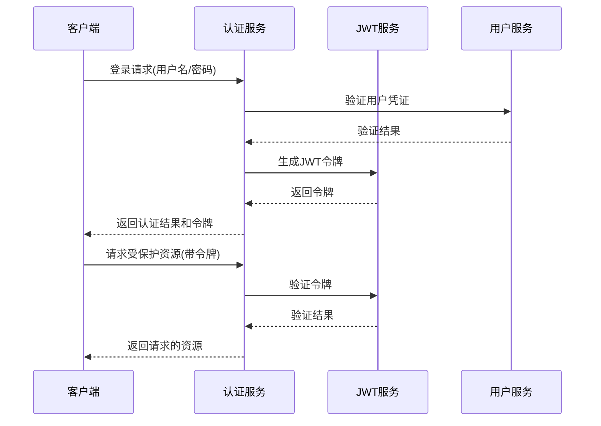
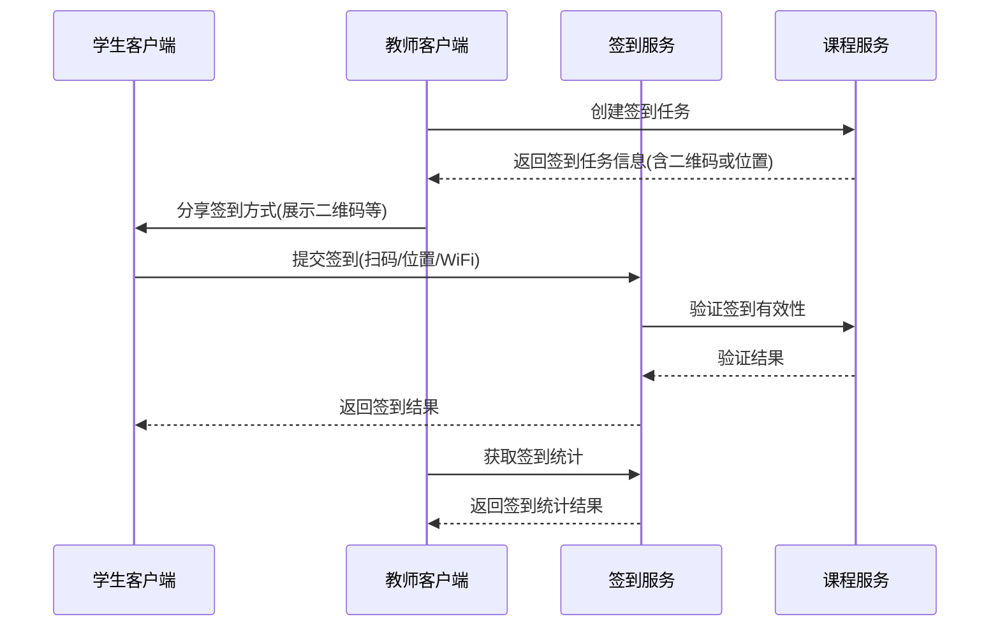
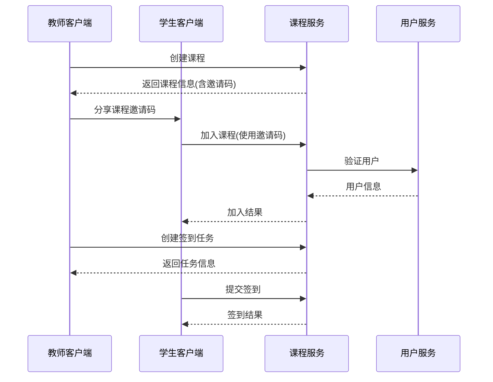

# 考勤系统API设计文档

## 基础规范

### 基础URL
所有API均以 `/api` 为前缀。

### 请求方法
- **GET**: 获取资源
- **POST**: 创建资源、执行操作或更新资源

### 响应格式
所有API响应均使用JSON格式，包含以下字段：
```json
{
  "code": 200,           // 状态码：200成功，非200表示错误
  "message": "操作成功",   // 操作结果描述
  "data": {}             // 响应数据，可能是对象或数组
}
```

### 分页格式
分页查询返回格式：
```json
{
  "code": 200,
  "message": "查询成功",
  "data": {
    "content": [],        // 当前页数据
    "totalElements": 100, // 总记录数
    "totalPages": 10,     // 总页数
    "size": 10,           // 每页大小
    "number": 0,          // 当前页码(从0开始)
    "first": true,        // 是否为第一页
    "last": false,        // 是否为最后一页
    "empty": false        // 是否为空结果
  }
}
```

### 分页参数
所有列表查询支持以下分页参数：
- `page`: 页码(从0开始)，默认0
- `size`: 每页大小，默认10，最大100

### 错误码
- 200: 成功
- 400: 请求参数错误
- 401: 未认证
- 403: 权限不足
- 404: 资源不存在
- 409: 资源冲突
- 500: 服务器内部错误

## 系统流程图

### 用户认证流程


### 签到流程


### 课程管理流程


## API概览列表

### 认证与用户API

| 接口 | 方法 | URL | 描述 |
|------|------|-----|------|
| 用户登录 | POST | /api/auth/login | 登录系统获取JWT令牌 |
| 用户注册 | POST | /api/auth/register | 注册新用户 |
| 获取当前用户信息 | GET | /api/users/current | 获取当前登录用户信息 |
| 获取用户列表 | GET | /api/users/list | 获取用户列表(分页) |
| 获取用户详情 | GET | /api/users/detail | 获取指定用户详情 |
| 更新用户信息 | POST | /api/users/update | 更新用户信息 |

### 课程API

| 接口 | 方法 | URL | 描述 |
|------|------|-----|------|
| 创建课程 | POST | /api/courses/create | 创建新课程 |
| 获取课程列表 | GET | /api/courses/list | 获取所有课程(分页) |
| 获取我的课程 | GET | /api/courses/my-list | 获取当前用户的课程(分页) |
| 获取课程详情 | GET | /api/courses/detail | 获取课程详细信息 |
| 更新课程 | POST | /api/courses/update | 更新课程信息 |
| 删除课程 | POST | /api/courses/remove | 删除课程 |

### 课程成员API

| 接口 | 方法 | URL | 描述 |
|------|------|-----|------|
| 获取课程成员列表 | GET | /api/courses/members/list | 获取课程成员(分页) |
| 添加课程成员 | POST | /api/courses/members/add | 批量添加课程成员 |
| 移除课程成员 | POST | /api/courses/members/remove | 移除课程成员 |
| 加入课程 | POST | /api/courses/members/join | 通过邀请码加入课程 |

### 签到任务API

| 接口 | 方法 | URL | 描述 |
|------|------|-----|------|
| 创建签到任务 | POST | /api/courses/tasks/create | 创建课程签到任务 |
| 获取签到任务列表 | GET | /api/courses/tasks/list | 获取课程签到任务(分页) |
| 更新签到任务 | POST | /api/courses/tasks/update | 更新签到任务 |
| 删除签到任务 | POST | /api/courses/tasks/remove | 删除签到任务 |

### 签到记录API

| 接口 | 方法 | URL | 描述 |
|------|------|-----|------|
| 提交签到 | POST | /api/attendance/records/create | 学生提交签到 |
| 获取签到记录列表 | GET | /api/attendance/records/list | 获取签到记录(分页) |
| 手动签到 | POST | /api/attendance/records/manual-create | 教师为学生手动添加签到 |
| 更新签到记录 | POST | /api/attendance/records/update | 更新签到状态 |

### 统计API

| 接口 | 方法 | URL | 描述 |
|------|------|-----|------|
| 获取课程签到统计 | GET | /api/statistics/course | 获取课程签到统计数据 |
| 获取学生签到统计 | GET | /api/statistics/student | 获取学生签到统计数据 |

## 详细API设计

### 认证API

#### 用户登录
- **URL**: `/api/auth/login`
- **方法**: POST
- **描述**: 登录系统并获取认证令牌
- **请求体**:
  ```json
  {
    "username": "用户名",
    "password": "密码"
  }
  ```
- **响应**:
  ```json
  {
    "code": 200,
    "message": "登录成功",
    "data": {
      "accessToken": "JWT令牌",
      "tokenType": "Bearer",
      "userId": "用户ID",
      "username": "用户名",
      "fullName": "用户全名",
      "role": "用户角色"
    }
  }
  ```

#### 用户注册
- **URL**: `/api/auth/register`
- **方法**: POST
- **描述**: 注册新用户
- **请求体**:
  ```json
  {
    "username": "用户名",
    "password": "密码",
    "fullName": "用户全名",
    "email": "邮箱",
    "phone": "手机号",
    "role": "STUDENT或TEACHER"
  }
  ```
- **响应**:
  ```json
  {
    "code": 200,
    "message": "注册成功",
    "data": {
      "id": "用户ID",
      "username": "用户名",
      "fullName": "用户全名",
      "email": "邮箱",
      "role": "角色",
      "enabled": true,
      "createdAt": "创建时间",
      "updatedAt": "更新时间"
    }
  }
  ```

### 用户API

#### 获取当前用户信息
- **URL**: `/api/users/current`
- **方法**: GET
- **描述**: 获取当前登录用户的信息
- **响应**:
  ```json
  {
    "code": 200,
    "message": "获取成功",
    "data": {
      "id": "用户ID",
      "username": "用户名",
      "fullName": "用户全名",
      "email": "邮箱",
      "phone": "手机号",
      "role": "角色",
      "enabled": true,
      "createdAt": "创建时间",
      "updatedAt": "更新时间"
    }
  }
  ```

#### 获取用户列表
- **URL**: `/api/users/list`
- **方法**: GET
- **描述**: 获取用户列表
- **权限**: 仅管理员和教师
- **查询参数**:
  - `role`(可选): 用户角色，如STUDENT、TEACHER
  - `keyword`(可选): 搜索关键词，匹配用户名、全名和邮箱
  - `page`: 页码
  - `size`: 每页大小
- **响应**: 分页格式

#### 获取用户详情
- **URL**: `/api/users/detail`
- **方法**: GET
- **描述**: 获取用户详情
- **查询参数**:
  - `id`: 用户ID
- **权限**: 仅允许管理员或用户本人访问
- **响应**:
  ```json
  {
    "code": 200,
    "message": "获取成功",
    "data": {
      "id": "用户ID",
      "username": "用户名",
      "fullName": "用户全名",
      "email": "邮箱",
      "phone": "手机号",
      "role": "角色",
      "enabled": true,
      "createdAt": "创建时间",
      "updatedAt": "更新时间"
    }
  }
  ```

#### 更新用户信息
- **URL**: `/api/users/update`
- **方法**: POST
- **描述**: 更新用户信息
- **权限**: 仅允许管理员或用户本人修改
- **请求体**:
  ```json
  {
    "id": "用户ID",
    "fullName": "更新的全名",
    "email": "更新的邮箱",
    "phone": "更新的手机号"
  }
  ```
- **响应**: 更新后的用户信息

### 课程API

#### 创建课程
- **URL**: `/api/courses/create`
- **方法**: POST
- **描述**: 创建新课程
- **权限**: 教师和管理员
- **请求体**:
  ```json
  {
    "name": "课程名称",
    "description": "课程描述",
    "startDate": "开始日期",
    "endDate": "结束日期"
  }
  ```
- **响应**: 创建的课程信息

#### 获取课程列表
- **URL**: `/api/courses/list`
- **方法**: GET
- **描述**: 获取课程列表
- **查询参数**:
  - `status`(可选): 课程状态，如ACTIVE、ENDED
  - `keyword`(可选): 搜索关键词，匹配课程名称和描述
  - `page`: 页码
  - `size`: 每页大小
- **响应**: 分页格式的课程列表

#### 获取我的课程
- **URL**: `/api/courses/my-list`
- **方法**: GET
- **描述**: 获取当前用户参与的所有课程
- **查询参数**:
  - `status`(可选): 课程状态
  - `page`: 页码
  - `size`: 每页大小
- **响应**: 分页格式的课程列表

#### 获取课程详情
- **URL**: `/api/courses/detail`
- **方法**: GET
- **描述**: 获取课程详情
- **查询参数**:
  - `id`: 课程ID
- **权限**: 课程成员才可访问
- **响应**: 课程详情信息

#### 更新课程
- **URL**: `/api/courses/update`
- **方法**: POST
- **描述**: 更新课程信息
- **权限**: 仅课程创建者或管理员
- **请求体**:
  ```json
  {
    "id": "课程ID",
    "name": "更新的名称",
    "description": "更新的描述",
    "startDate": "更新的开始日期",
    "endDate": "更新的结束日期",
    "status": "更新的状态"
  }
  ```
- **响应**: 更新后的课程信息

#### 删除课程
- **URL**: `/api/courses/remove`
- **方法**: POST
- **描述**: 逻辑删除课程
- **权限**: 仅课程创建者或管理员
- **请求体**:
  ```json
  {
    "id": "课程ID",
    "deleteReason": "删除原因(可选)"
  }
  ```
- **响应**: 成功消息

### 课程成员API

#### 获取课程成员列表
- **URL**: `/api/courses/members/list`
- **方法**: GET
- **描述**: 获取课程成员列表
- **权限**: 课程成员才可访问
- **查询参数**:
  - `courseId`: 课程ID
  - `role`(可选): 成员角色
  - `page`: 页码
  - `size`: 每页大小
- **响应**: 分页格式的成员列表

#### 添加课程成员
- **URL**: `/api/courses/members/add`
- **方法**: POST
- **描述**: 添加课程成员
- **权限**: 仅课程创建者或助教
- **请求体**:
  ```json
  {
    "courseId": "课程ID",
    "userIds": ["用户ID1", "用户ID2", ...],
    "role": "成员角色(如STUDENT)"
  }
  ```
- **响应**: 添加成功消息和添加的成员列表

#### 移除课程成员
- **URL**: `/api/courses/members/remove`
- **方法**: POST
- **描述**: 移除课程成员
- **权限**: 仅课程创建者或助教
- **请求体**:
  ```json
  {
    "courseId": "课程ID",
    "userId": "用户ID",
    "removeReason": "移除原因(可选)"
  }
  ```
- **响应**: 成功消息

#### 加入课程
- **URL**: `/api/courses/members/join`
- **方法**: POST
- **描述**: 通过邀请码加入课程
- **请求体**:
  ```json
  {
    "code": "课程邀请码",
    "joinMethod": "加入方式(CODE或QR_CODE)"
  }
  ```
- **响应**: 成功消息和课程信息

### 签到任务API

#### 创建签到任务
- **URL**: `/api/courses/tasks/create`
- **方法**: POST
- **描述**: 创建课程签到任务
- **权限**: 仅课程创建者或助教
- **请求体**:
  ```json
  {
    "parentCourseId": "所属课程ID",
    "name": "签到任务名称",
    "description": "签到任务描述",
    "startTime": "签到开始时间",
    "endTime": "签到结束时间",
    "checkinType": "签到类型(QR_CODE/LOCATION/WIFI/MANUAL)",
    "verifyParams": {
      // 根据签到类型不同而不同
      // QR_CODE: {}
      // LOCATION: {"latitude": 纬度, "longitude": 经度, "radius": 半径}
      // WIFI: {"ssid": "WiFi名称", "bssid": "MAC地址"}
    }
  }
  ```
- **响应**: 创建的签到任务信息

#### 获取签到任务列表
- **URL**: `/api/courses/tasks/list`
- **方法**: GET
- **描述**: 获取课程的签到任务列表
- **权限**: 课程成员才可访问
- **查询参数**:
  - `courseId`: 课程ID
  - `status`(可选): 任务状态
  - `page`: 页码
  - `size`: 每页大小
- **响应**: 分页格式的签到任务列表

#### 更新签到任务
- **URL**: `/api/courses/tasks/update`
- **方法**: POST
- **描述**: 更新签到任务
- **权限**: 仅任务创建者或课程管理员
- **请求体**:
  ```json
  {
    "id": "签到任务ID",
    "name": "更新的名称",
    "description": "更新的描述",
    "startTime": "更新的开始时间",
    "endTime": "更新的结束时间",
    "status": "更新的状态"
  }
  ```
- **响应**: 更新后的签到任务信息

#### 删除签到任务
- **URL**: `/api/courses/tasks/remove`
- **方法**: POST
- **描述**: 逻辑删除签到任务
- **权限**: 仅任务创建者或课程管理员
- **请求体**:
  ```json
  {
    "id": "签到任务ID",
    "deleteReason": "删除原因(可选)"
  }
  ```
- **响应**: 成功消息

### 签到记录API

#### 提交签到
- **URL**: `/api/attendance/records/create`
- **方法**: POST
- **描述**: 学生提交签到
- **请求体**:
  ```json
  {
    "courseId": "签到任务ID",
    "location": {
      "latitude": 纬度,
      "longitude": 经度
    },
    "device": "设备信息",
    "verifyMethod": "签到方式(QR_CODE/LOCATION/WIFI)",
    "verifyData": "签到验证数据"
  }
  ```
- **响应**: 签到结果

#### 获取签到记录列表
- **URL**: `/api/attendance/records/list`
- **方法**: GET
- **描述**: 获取签到记录
- **权限**: 教师可查看所有记录，学生只能查看自己的记录
- **查询参数**:
  - `courseId`(可选): 签到任务ID
  - `parentCourseId`(可选): 所属课程ID
  - `userId`(可选): 用户ID
  - `status`(可选): 签到状态
  - `startDate`(可选): 签到日期起始
  - `endDate`(可选): 签到日期结束
  - `page`: 页码
  - `size`: 每页大小
- **响应**: 分页格式的签到记录列表

#### 手动签到
- **URL**: `/api/attendance/records/manual-create`
- **方法**: POST
- **描述**: 教师为学生手动添加签到记录
- **权限**: 仅课程创建者或助教
- **请求体**:
  ```json
  {
    "courseId": "签到任务ID",
    "userId": "学生用户ID",
    "status": "签到状态(NORMAL/LATE/LEAVE)"
  }
  ```
- **响应**: 创建的签到记录

#### 更新签到记录
- **URL**: `/api/attendance/records/update`
- **方法**: POST
- **描述**: 更新签到记录（如修改状态）
- **权限**: 仅课程创建者或助教
- **请求体**:
  ```json
  {
    "id": "签到记录ID",
    "status": "更新的状态",
    "comment": "备注信息(可选)"
  }
  ```
- **响应**: 更新后的签到记录

### 统计API

#### 获取课程签到统计
- **URL**: `/api/statistics/course`
- **方法**: GET
- **描述**: 获取课程签到统计信息
- **权限**: 仅课程创建者或助教
- **查询参数**:
  - `courseId`: 课程ID
- **响应**:
  ```json
  {
    "code": 200,
    "message": "获取成功",
    "data": {
      "courseId": "课程ID",
      "courseName": "课程名称",
      "totalStudents": 30,
      "totalTasks": 10,
      "attendanceRate": 0.95,
      "statusDistribution": {
        "NORMAL": 280,
        "LATE": 12,
        "ABSENT": 8
      },
      "taskStatistics": [
        {
          "taskId": "任务ID",
          "taskName": "任务名称",
          "date": "日期",
          "normalCount": 28,
          "lateCount": 1,
          "absentCount": 1,
          "attendanceRate": 0.97
        }
      ]
    }
  }
  ```

#### 获取学生签到统计
- **URL**: `/api/statistics/student`
- **方法**: GET
- **描述**: 获取学生签到统计信息
- **查询参数**:
  - `courseId`: 课程ID
  - `userId`: 学生ID (如不提供，则获取当前用户统计)
- **响应**:
  ```json
  {
    "code": 200,
    "message": "获取成功",
    "data": {
      "userId": "学生ID",
      "userName": "学生姓名",
      "courseId": "课程ID",
      "courseName": "课程名称",
      "totalTasks": 10,
      "attendanceRate": 0.9,
      "normalCount": 8,
      "lateCount": 1,
      "absentCount": 1,
      "records": [
        {
          "taskId": "任务ID",
          "taskName": "任务名称",
          "date": "日期",
          "status": "签到状态",
          "checkInTime": "签到时间"
        }
      ]
    }
  }
  ```

## API 调用示例 (curl)

### 认证与用户管理

#### 用户登录
```bash
curl -X POST "http://localhost:8080/api/auth/login" \
  -H "Content-Type: application/json" \
  -d '{
    "username": "teacher1",
    "password": "password123"
  }'
```

#### 用户注册
```bash
curl -X POST "http://localhost:8080/api/auth/register" \
  -H "Content-Type: application/json" \
  -d '{
    "username": "newstudent",
    "password": "Secure@123",
    "fullName": "新同学",
    "email": "student@example.com",
    "phone": "13812345678",
    "role": "STUDENT"
  }'
```

#### 获取当前用户信息
```bash
curl -X GET "http://localhost:8080/api/users/current" \
  -H "Authorization: Bearer {JWT令牌}"
```

#### 更新用户信息
```bash
curl -X POST "http://localhost:8080/api/users/update" \
  -H "Content-Type: application/json" \
  -H "Authorization: Bearer {JWT令牌}" \
  -d '{
    "id": "user-uuid-1",
    "fullName": "更新后的姓名",
    "email": "updated@example.com",
    "phone": "13800001111"
  }'
```

### 课程管理

#### 创建课程
```bash
curl -X POST "http://localhost:8080/api/courses/create" \
  -H "Content-Type: application/json" \
  -H "Authorization: Bearer {JWT令牌}" \
  -d '{
    "name": "Java编程实践",
    "description": "面向对象编程与设计模式实践",
    "startDate": "2023-09-01",
    "endDate": "2024-01-15"
  }'
```

#### 获取我的课程
```bash
curl -X GET "http://localhost:8080/api/courses/my-list?page=0&size=10" \
  -H "Authorization: Bearer {JWT令牌}"
```

#### 通过邀请码加入课程
```bash
curl -X POST "http://localhost:8080/api/courses/members/join" \
  -H "Content-Type: application/json" \
  -H "Authorization: Bearer {JWT令牌}" \
  -d '{
    "code": "JAVA123",
    "joinMethod": "CODE"
  }'
```

### 签到任务管理

#### 创建签到任务
```bash
curl -X POST "http://localhost:8080/api/courses/tasks/create" \
  -H "Content-Type: application/json" \
  -H "Authorization: Bearer {JWT令牌}" \
  -d '{
    "parentCourseId": "course-uuid-1",
    "name": "第4周Java课程签到",
    "description": "第4周Java编程实践课程签到",
    "startTime": "2023-09-26T09:00:00",
    "endTime": "2023-09-26T09:15:00",
    "checkinType": "QR_CODE",
    "verifyParams": {}
  }'
```

#### 获取课程签到任务列表
```bash
curl -X GET "http://localhost:8080/api/courses/tasks/list?courseId=course-uuid-1&page=0&size=10" \
  -H "Authorization: Bearer {JWT令牌}"
```

### 签到记录管理

#### 学生提交签到
```bash
curl -X POST "http://localhost:8080/api/attendance/records/create" \
  -H "Content-Type: application/json" \
  -H "Authorization: Bearer {JWT令牌}" \
  -d '{
    "courseId": "checkin-uuid-3",
    "location": {
      "latitude": 39.908823,
      "longitude": 116.397470
    },
    "device": "{\"type\":\"Android\",\"model\":\"Pixel 6\"}",
    "verifyMethod": "QR_CODE",
    "verifyData": "{\"code\":\"qrcode-token-3\"}"
  }'
```

#### 教师手动签到
```bash
curl -X POST "http://localhost:8080/api/attendance/records/manual-create" \
  -H "Content-Type: application/json" \
  -H "Authorization: Bearer {JWT令牌}" \
  -d '{
    "courseId": "checkin-uuid-3",
    "userId": "student-uuid-5",
    "status": "NORMAL"
  }'
```

#### 获取签到记录列表
```bash
curl -X GET "http://localhost:8080/api/attendance/records/list?courseId=checkin-uuid-1&page=0&size=10" \
  -H "Authorization: Bearer {JWT令牌}"
```

### 统计分析

#### 获取课程签到统计
```bash
curl -X GET "http://localhost:8080/api/statistics/course?courseId=course-uuid-1" \
  -H "Authorization: Bearer {JWT令牌}"
```

#### 获取学生签到统计
```bash
curl -X GET "http://localhost:8080/api/statistics/student?courseId=course-uuid-1&userId=student-uuid-1" \
  -H "Authorization: Bearer {JWT令牌}"
``` 